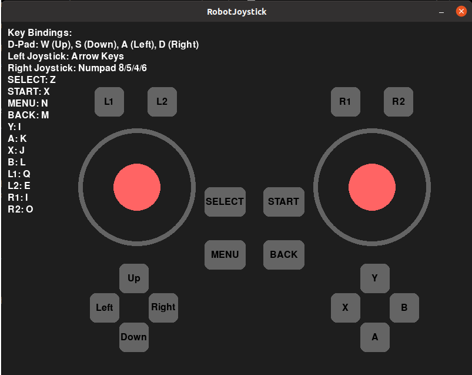
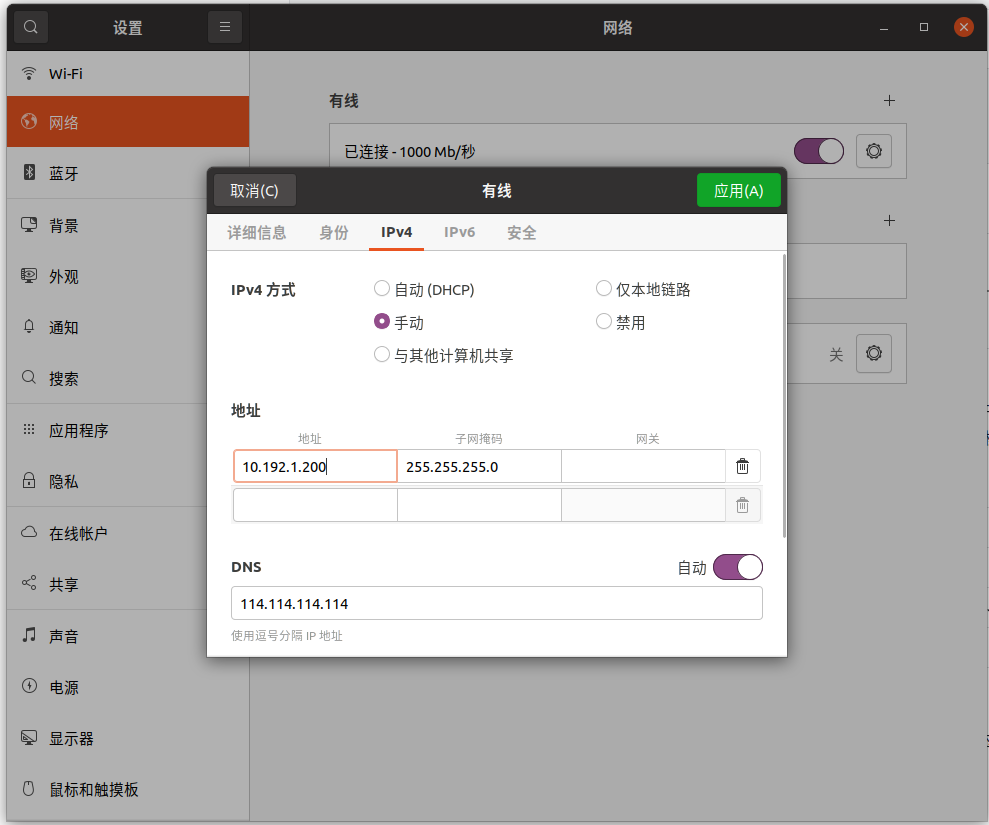

# English | [中文](README_cn.md)
# Deployment of Training Results


## 1. Deployment Environment Configuration

- Install ROS 2 Foxy: Set up a ROS 2 Foxy-based algorithm Development Environment on the Ubuntu 20.04 operating system. For installation, please refer to the documentation: https://docs.ros.org/en/foxy/Installation/Ubuntu-Install-Debians.html, and choose "ros-foxy-desktop" for installation. After the installation of ROS 2 Foxy is completed, enter the following Shell commands in the Bash end point to install the libraries required by the Development Environment:

    ```bash
    sudo apt update
    sudo apt install ros-foxy-urdf \
                ros-foxy-urdfdom \
                ros-foxy-urdfdom-headers \
                ros-foxy-kdl-parser \
                ros-foxy-hardware-interface \
                ros-foxy-controller-manager \
                ros-foxy-controller-interface \
                ros-foxy-controller-manager-msgs \
                ros-foxy-control-msgs \
                ros-foxy-controller-interface \
                ros-foxy-gazebo-* \
                ros-foxy-rviz* \
                ros-foxy-rqt-gui \
                ros-foxy-rqt-robot-steering \
                ros-foxy-plotjuggler* \
                ros-foxy-control-toolbox \
                ros-foxy-ros2-control \
                ros-foxy-ros2-controllers \
                ros-dev-tools \
                cmake build-essential libpcl-dev libeigen3-dev libopencv-dev libmatio-dev \
                python3-pip libboost-all-dev libtbb-dev liburdfdom-dev liborocos-kdl-dev -y
    ```

    

- Install the onnxruntime dependency, download link:https://github.com/microsoft/onnxruntime/releases/tag/v1.10.0. Please choose the appropriate version to download according to your operating system and platform. For example, on Ubuntu 20.04 x86_64, please follow the steps below for installation:
  
    ```Bash
    wget https://github.com/microsoft/onnxruntime/releases/download/v1.10.0/onnxruntime-linux-x64-1.10.0.tgz
    
    tar xvf onnxruntime-linux-x64-1.10.0.tgz
    
    sudo cp -a onnxruntime-linux-x64-1.10.0/include/* /usr/include
    sudo cp -a onnxruntime-linux-x64-1.10.0/lib/* /usr/lib
    ```


## 2. Create a Workspace

You can create an RL deployment development workspace by following these steps:
- Open a Bash terminal.
- Create a new directory to store the workspace. For example, you can create a directory named "limx_ws" in the user's home directory:
    ```Bash
    mkdir -p ~/limx_ws/src
    ```
    
- Download the MuJoCo simulator
    ```Bash
    cd ~/limx_ws

    # Option 1: HTTPS
    git clone --recurse https://github.com/limxdynamics/humanoid-mujoco-sim.git

    # Option 2: SSH
    git clone --recurse git@github.com:limxdynamics/humanoid-mujoco-sim.git
    ```
    
- Download the motion control algorithm:
    ```Bash
    cd ~/limx_ws

    # Option 1: HTTPS
    git clone -b feature/foxy --recurse https://github.com/limxdynamics/humanoid-rl-deploy-ros2.git

    # Option 2: SSH
    git clone -b feature/foxy --recurse git@github.com:limxdynamics/humanoid-rl-deploy-ros2.git
    ```
    
- Set the robot model: If not set yet, follow these steps.

  - List the available robot types using the Shell command `tree -L 1 humanoid-rl-deploy-ros2/robot_controllers/config` ：

    ```
    cd ~/limx_ws/humanoid-rl-deploy-2/src
    tree -L 1 humanoid-rl-deploy-ros2/robot_controllers/config
    humanoid-rl-deploy-ros2/robot_controllers/config
    ├── HU_D03_03
    └── HU_D04_01
    
    ```

  - Take `HU_D04_01` (please replace it with the actual robot type) as an example to set the robot model type:

    ```
    echo 'export ROBOT_TYPE=HU_D04_01' >> ~/.bashrc && source ~/.bashrc
    ```

### 4. Simulation Debugging

- Run the MuJoco simulator (Python 3.8 or above is recommended)

  - Open a Bash terminal.

  - Install the motion control development library:

    - Linux x86_64 environment

      ```bash
      cd ~/limx_ws
      pip install humanoid-mujoco-sim/limxsdk-lowlevel/python3/amd64/limxsdk-*-py3-none-any.whl
      ```

    - Linux aarch64 environment

      ```bash
      cd ~/limx_ws
      pip install humanoid-mujoco-sim/limxsdk-lowlevel/python3/aarch64/limxsdk-*-py3-none-any.whl
      ```

  - Run the MuJoCo simulator:

    ```bash
    cd ~/limx_ws
    python humanoid-mujoco-sim/simulator.py
    ```

- Run the algorithm

  - Open a Bash terminal.

  - Navigate to your workspace and complete the compilation:

    ```bash
    # If you have Conda installed, temporarily deactivate the Conda environment
    # Because Conda may interfere with the ROS runtime environment settings
    conda deactivate

    # Set up the ROS compilation environment
    source /opt/ros/foxy/setup.bash

    # Compile the algorithm code
    cd ~/limx_ws/humanoid-rl-deploy-ros2
    colcon build --cmake-args -DCMAKE_BUILD_TYPE=Release
    ```

  - Run the algorithm

    ```bash
    # If you have Conda installed, temporarily deactivate the Conda environment
    # Because Conda may interfere with the ROS runtime environment settings
    conda deactivate

    # Set up the ROS compilation environment
    source /opt/ros/foxy/setup.bash

    # Run the algorithm
    cd ~/limx_ws/humanoid-rl-deploy-ros2
    source install/setup.bash
    ros2 launch robot_hw humanoid_hw_sim.launch.py
    ```

    

- Virtual remote controller: You can use a virtual remote controller to operate the robot during simulation. The following are the specific steps to use the virtual remote controller.

  - Open a Bash terminal.

  - Run the virtual remote controller

    ```
    ~/limx_ws/humanoid-mujoco-sim/robot-joystick/robot-joystick
    ```

    


  - At this point, you can use the virtual remote controller to control the robot.

    | **Button** | **Mode**         | **Description**                                                    |
    | -------- | ---------------- | ----------------------------------------------------------- |
    | L1+Y     | Switch to standing mode   | If the robot cannot stand, click "Reset" in the MuJoco interface to reset it. |
    | L1+B     | Switch to greeting mode |                                                             |

### 4. Real Machine Debugging

- Set your computer's IP: Ensure that your computer is connected to the robot body through an external network port. Set your computer's IP address to: `10.192.1.200`, and you can successfully ping `10.192.1.2` using the Shell command `ping 10.192.1.2`. Set the IP of your development computer as shown in the following figure:

  

- Algorithm compilation:

  ```bash
  # If you have Conda installed, temporarily deactivate the Conda environment
  # Because Conda may interfere with the ROS runtime environment settings
  conda deactivate

  # Set up the ROS compilation environment
  source /opt/ros/foxy/setup.bash

  # Compile the algorithm code
  cd ~/limx_ws/humanoid-rl-deploy-ros2
  colcon build --cmake-args -DCMAKE_BUILD_TYPE=Release
  ```

- Robot preparation:

  - Hang the robot with the hooks on the left and right shoulders.
  - After turning on the power, press the right joystick button on the remote controller to start the robot's motors.
  - Press the remote controller buttons `L1 + START` to switch to developer mode. In this mode, users can develop their own motion control algorithms. (This mode will remain effective after the next startup; to exit developer mode, press `L1 + L2 + START`).

- Real machine deployment and operation. In the Bash terminal, simply use the following Shell command to start the control algorithm:

  ```bash
  # If you have Conda installed, temporarily deactivate the Conda environment
  # Because Conda may interfere with the ROS runtime environment settings
  conda deactivate

  # Set up the ROS compilation environment
  source /opt/ros/foxy/setup.bash

  # Run the algorithm
  cd ~/limx_ws/humanoid-rl-deploy-ros2
  source install/setup.bash
  ros2 launch robot_hw humanoid_hw.launch.py
  ```

- At this point, you can use the remote controller button `L1 + Y` to make the robot enter the standing mode.

- Press `L1 + B` on the remote controller to control the robot to greet.
